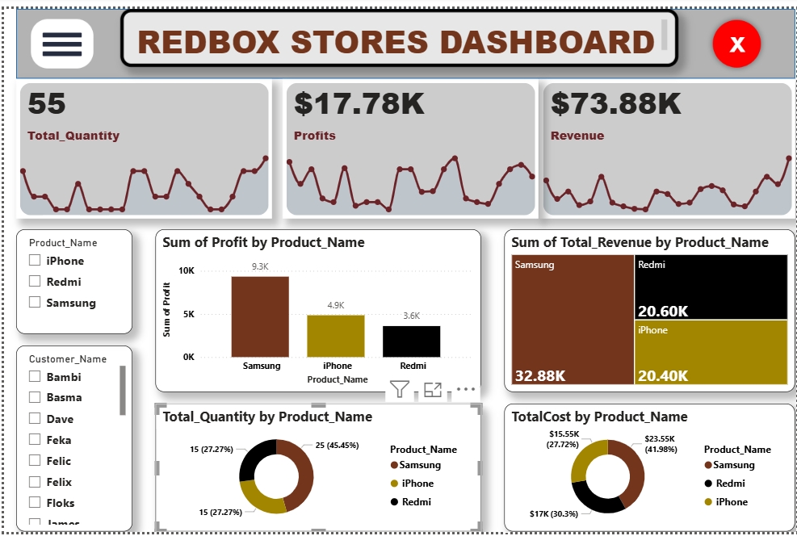

# Redbox-Stores-Transaction-Analysis-Samsung-iPhone-Redmi

## TABLE OF CONTENT

- [INTRODUCTION](#Introduction)

- [DATA DESCRIPTION](#Data-Description)

- [Data Collection and Preparation ](#Data-Collection-and-Preparation)

- [Data Analysis](#Data-Analysis)

- [Skills demonstrated](#Skills-demonstrated)

- [Visualizations](#Visualizations)

- [Insight from analysis](#Insight-from-analysis)

- [Summary of Analysis](#Summary-of-Analysis)

- [Conclusion](#Conclusion)

## INTRODUCTION
Redbox Stores is a retail outlet in Georgia that specializes in the sales of mobile phones, particularly Samsung, iPhone, and Redmi brands. The dataset under review captures individual customer transactions, including details such as customer ID, customer name, product purchased, product ID, quantity, unit price, cost price, transaction date, and state.
The purpose of this analysis is to evaluate the sales performance and profitability of Redbox Stores over the recorded period. By examining key metrics such as total revenue, cost of goods sold, profit margins, customer purchasing behavior, and product demand, this report provides valuable insights into business operations.

## Data-Description
The dataset used for this analysis represents transactional records from Redbox Stores, Georgia, focusing on mobile phone sales. It contains information about customers, products, and sales details across a given time period.
- Customer ID – Unique identifier assigned to each customer.
- Customer Name – The name of the customer who made the purchase.
- Product Type – Category of mobile phone purchased (Samsung, iPhone, Redmi).
- Product ID – Unique identifier for each product.
- Quantity – Number of units purchased in a transaction.
- Unit Price – The selling price of one unit of the product.
- Cost Price – The purchase cost of one unit of the product.
- Transaction Date – Date on which the transaction occurred.
- State – The location of the store (Georgia).

## Data Collection and Preparation 
#### Raw data:
The raw dataset used in this analysis.
[RedBox_Stores](RedBox_Stores.xlsx)

### Tools used: Excel(Power Query editor), Powerbi(Dax-Measure and columns)

## SKILLS DEMONSTRATED:
- Excel
 - Load the dataset into Power Query Editor through excel and click on transform for cleaning the dataset
 - clicking for duplicate in the dataset of which there is no duplicate.
 - Changing the data types of columns such as Customer_ID, Product_ID, Quantity, and Cost Price to whole numbers
 - Renaming values in the columns, such as converting text to numbers in the Quantity and Cost Price columns
 - Splitting the Customer Name column into two separate columns (Customer_Name and Product_Name).

- Power Bi
   - Using Dax Create  New Columns for Total_Cost, Total_Revenue, Profit
    - Total_Cost = redbox[Quantity]* redbox[Cost_Price]
    - Total_Revenue = redbox[Quantity]*redbox[Unit_Price]
    - Profit = redbox[Total_Revenue]-redbox[Total_Cost]
   -  Using dax to Create New Measures for Profits,TotalCost, Total_Quantity,Revenue
    -  Profits = SUM(redbox[Profit])
    -  TotalCost = SUM(redbox[Total_Cost])
    -  Total_Quantity = SUM(redbox[Quantity])
    -  Revenue = SUM(redbox[Total_Revenue])
   
### Data Analysis: 
    - Sum of Profit by Product_Name
    - Sum of Total_Revenue by Product_Name
    - Total_Quantity by Product_Name
    - TotalCost by Product_Name

## Visualizations:
To better understand sales performance, profitability, and customer behavior, several visualizations were created from the Redbox Stores dataset. These charts and graphs provide a clear picture of key business insights:
  - Stacked column chart
  - Treemap
  - Donut Chart
  - Slicer
  - Cards

  - 

## Insight from analysis
  - Profit margins were highest on iPhones, making them the most profitable product category.
  - This suggests that iPhones not only bring high sales but also maintain strong profitability.
  - iPhones generated the highest revenue, reflecting their strong market demand despite higher prices.
  - Redmi phones showed strong sales volume, but due to lower unit prices, their overall profit contribution was less than Samsung and iPhone.
  - Samsung phones delivered a balanced performance with moderate revenue and healthy profit margins.

## Summary-of-Analysis
- The sales analysis of Redbox Stores (Georgia branch) provided valuable insights into product performance, customer behavior, and overall profitability. Using the raw transactional dataset, key metrics such as revenue, cost, and profit were calculated and visualized for deeper understanding.
Product Analysis showed that iPhones generated the highest revenue and profit, Samsung provided stable margins with consistent sales, while Redmi contributed high sales volume but relatively lower profits.
- Profitability Analysis demonstrated that while all products were profitable, iPhones had the strongest profit margins, followed by Samsung, with Redmi being the least profitable.

